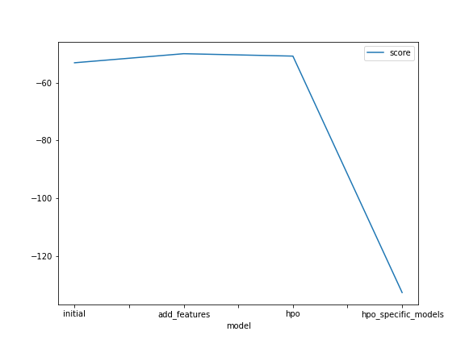
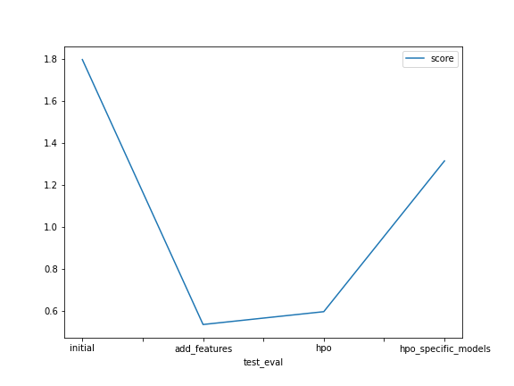

# Report: Predict Bike Sharing Demand with AutoGluon Solution

#### Lucas Stelmastchuk Santos

## Initial Training

### What did you realize when you tried to submit your predictions? What changes were needed to the output of the predictor to submit your results?

The predictor might output negative values, which are not accepted by Kaggle. To check if this is the case, the predictions were described with the describe method and the minimum value was verified to be greater or equal than zero. If negative values were present, they were all set to zero.

### What was the top ranked model that performed?

The second model was the best performing. This model included new time features, but did not undergo any hyperparameter optimization.

## Exploratory data analysis and feature creation

### What did the exploratory analysis find and how did you add additional features?

The exploratory analysis was useful to note the presence of categorical features such as season and weather whose types could be changed to 'categorical'.

Another import result of the exploratory analysis concerned the datetime column, which carried a lot of information that could not be used by the model to improve its predictions, as it was not properly encoded. To get around this difficulty, new features were created that better conveyed time information to the model. These features included day of month, hour and month of year. 

### How much better did your model preform after adding additional features and why do you think that is?

By just adding the new time features the performance went from 1.79648 to 0.53646, which was a massive improvement. This happened because the model was in a better position to find patterns in bike demand related to time that contributed to better predictions. As bikers surely have preferences of time of day for renting a bike and the demand fluctuates around the months of the year, the new features made it much easier for the model to pick these patterns.

## Hyper parameter tuning

### How much better did your model preform after trying different hyper parameters?

The performance after increasing num_bag_folds, num_bag_sets and num_stack_levels went from 0.53646 to 0.59752. 

The worse performance might be justified by the fact that increasing these high level parameters made the models more complex, as bagging and stacking were more heavily used. The increase in complexity caused the models to overfit and show a worse generalization score on Kaggle.

### If you were given more time with this dataset, where do you think you would spend more time?

The experiments in this project clearly showed that feature engineering was a crucial step in improving the performance of the models, even more so than hyperparameter tuning. More time could definitely be spent on creating new and better features.

### Create a table with the models you ran, the hyperparameters modified, and the kaggle score.

| model        | num_bag_folds | num_bag_sets | num_stack_levels | score   |
| ------------ | ------------- | ------------ | ---------------- | ------- |
| initial      | 8             | 20           | 1                | 1.79648 |
| add_features | 8             | 20           | 1                | 0.5364  |
| hpo          | 10            | 20           | 3                | 0.5975  |

### Create a line plot showing the top model score for the three (or more) training runs during the project.

### Create a line plot showing the top kaggle score for the three (or more) prediction submissions during the project.

## Summary

In this project Autogluon was used to quickly iterate with the Bike Share Demand dataset. Predictions were made using Autogluon out-of-the-box, and then the performance was increased by creating time features from the datetime column. Hyperparameter tuning using high level parameters from Autogluon TabularPredictor did not improve generalization error. More time could be spent on creating better features for the models.
